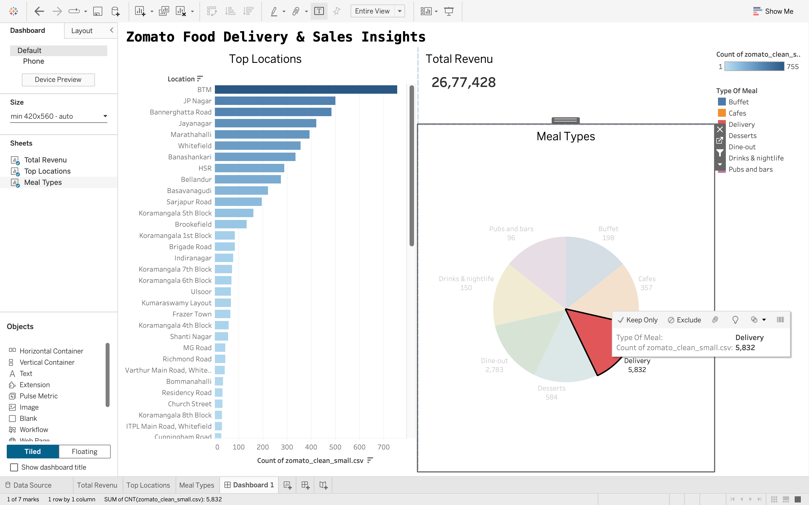

# 🍽️ Zomato Food Delivery & Customer Insights Dashboard

## 📌 Project Overview

This project analyzes Zomato restaurant and food delivery data using Python (Pandas) and Tableau.

The objective is to identify customer preferences, restaurant performance, sales trends, and business insights through interactive visualizations.

## 📊 Dashboard Preview

## 🛠️ Tools Used

* Python
* Pandas
* Tableau
* Jupyter Notebook

## 📁 Files Included

* dashboard.png
* zomato_clean_small.csv
* zomato_dashboard.twbx
* zomato_analysis.ipynb

## 🔍 Key Insights

* Customer ordering behavior
* Restaurant performance analysis
* Sales trend analysis
* Regional demand insights

## 👨‍💻 Author

Adarsh Patidar

B.Tech IT | Aspiring Data Analyst
